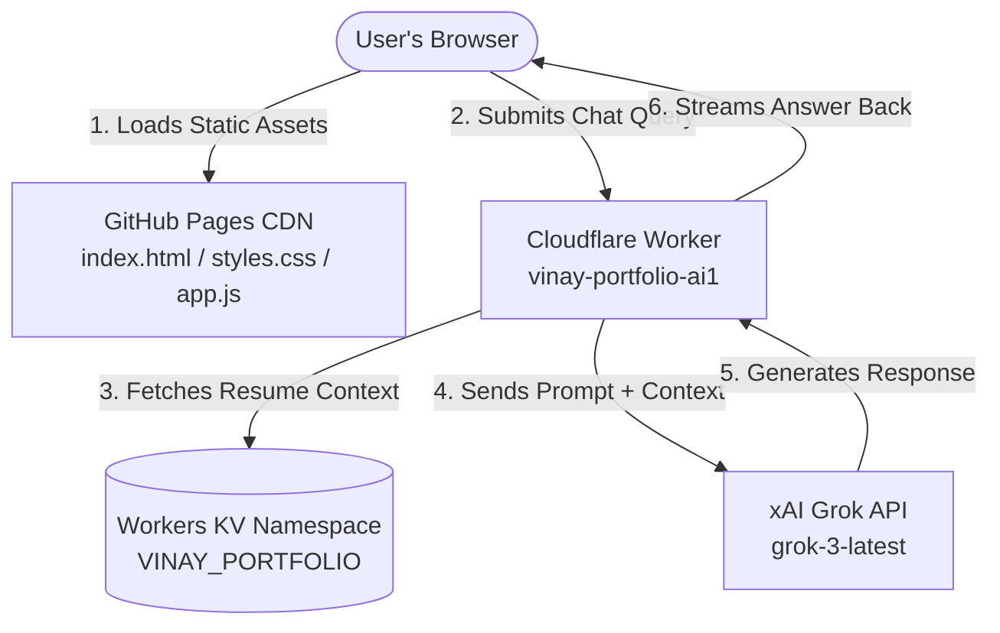

# Vinay B Rao — Professional Portfolio Documentation

This document serves as the comprehensive technical documentation for the professional portfolio website of **Vinay B Rao**, Senior Product Manager. It acts as a complete hand-off guide for any developer inheriting, maintaining, or scaling this codebase.

---

# 1. Project Overview

### Purpose of the Portfolio
The portfolio is designed as an interactive, premium showcase of Vinay B Rao's 12+ years of experience in Product Management. Unlike standard static resume sites, this portfolio demonstrates Vinay's product thinking through **live interactive experiences** (such as a simulated B2B2C payment collection microservice) and an **AI-powered interactive chat assistant** ("Ask Vinay") that answers questions grounded directly in his professional history.

### Target Audience
* **Hiring Managers & Recruiters:** Looking for rapid validation of Vinay’s PM competencies, metrics-driven achievements, and career history.
* **Technical Founders & Executive Sponsors:** Looking for proof of technical PM capabilities, API design understanding, and platform thinking.
* **Industry Peers:** Interested in product case studies and B2B SaaS/Payments design patterns.

### Major Capabilities
* **Dynamic Single-Page Application (SPA) Nav:** Instantaneous transition between views (Portfolio, Ask Vinay, Case Studies, and Experience/Demos) without page reloads.
* **Interactive B2B2C Payment Journey Simulation:** Demonstrates a multi-step payment gateway flow (Net Banking, Card, UPI) modeled on a stamp duty payment system ($3M monthly volume), complete with countdown timers and dynamic PDF invoice generation.
* **Server-Grounded AI Assistant:** Let visitors query Vinay's resume using xAI's Grok API via a secure Cloudflare Worker connected to Workers KV storage.
* **Client-Side Portfolio Editor:** Inline edit modes for real-time proofing and testing of resume copy.
* **Premium Aurora Dark Aesthetic:** Fluid particle physics canvas animations and micro-interactions creating an immersive, state-of-the-art visual style.

### Key User Journeys
1. **The Scanner Journey:** A recruiter lands on the portfolio, reviews the high-impact metrics (e.g. $400K+ ARR, 90% ticket reduction), reads the summary, and inspects the chronological employment history.
2. **The Evaluator Journey (Case Studies):** A hiring manager navigates to the Case Studies tab and reads through detailed product discovery and GTM breakdowns for projects like *WhatsApp SafeChat*, *Rapido Wanderlust*, and *Increasing Course Completion Rates* (Coursera).
3. **The Interactive Validation Journey (Demos):** An engineer or product leader opens the Experience tab and triggers the payment simulation to verify user experience design, edge-case handling (timeouts), and system flow.
4. **The Interview Prep Journey (AI Chat):** A team member preparing to interview Vinay uses the "Ask" tab to submit queries (e.g., "Tell me about a time you shipped with limited resources") and receives warm, professional answers in the first person.

### Technologies Used
* **Frontend:** Vanilla HTML5, Vanilla JavaScript (ES6+), Vanilla CSS3 variables & animations.
* **Serverless Backend:** Cloudflare Workers (V8 runtime engine).
* **Storage & Context:** Cloudflare Workers KV (Key-Value database).
* **AI Model:** xAI Grok (specifically `grok-3-latest` / `grok-4.20-reasoning` API models).
* **Developer Tools:** Node.js (specifically for `split.js` source separation).

---

# 2. System Architecture



### Architectural Decisions

* **Static Frontend on GitHub Pages:**
  * **Why:** High availability, zero hosting costs, globally distributed CDN edge locations, and seamless integration with GitHub repositories for continuous deployment.
  * **Benefit:** Instant first-contentful-paint (FCP) and no complex web servers to manage.

* **Serverless Logic on Cloudflare Workers:**
  * **Why:** Traditional static hosting cannot securely store API keys or execute server-side prompting. Cloudflare Workers run at the network edge with negligible cold starts (<5ms) and no server overhead.
  * **Benefit:** Hides the xAI API key (`GROK_API_KEY`) and prevents users from manipulating the system prompt in their browser console.

* **Workers KV (Key-Value Storage):**
  * **Why:** Storing Vinay's full context document (`context.md`) directly in the Worker script bundle increases memory footprint and requires code redeployments to update a typo. KV allows out-of-band updates.
  * **Benefit:** Read requests are cached at Cloudflare edge locations worldwide, making context extraction extremely fast.

### Data Flow & Request Flow
1. The user inputs a query in the Ask input box and clicks send.
2. The browser creates an `AbortController` and fires a `POST` request to `https://vinay-portfolio-ai1.braovinay.workers.dev/` containing only `{ "question": "..." }`.
3. The Worker interceptor checks for preflight `OPTIONS` and CORS validation.
4. The Worker queries Cloudflare KV for the key `vinay_context` in the `VINAY_PORTFOLIO` namespace.
5. The Worker inserts this text into the system prompt template.
6. The Worker initiates a secure HTTPS POST to the xAI endpoint `https://api.x.ai/v1/chat/completions` with the system prompt and the user's question.
7. The Grok API returns the generated completion.
8. The Worker forwards the response JSON back to the user's browser, decorated with proper CORS headers.
9. The browser receives the JSON, parses the markdown, and types it out on screen.

### Security Considerations
* **API Key Extraction:** The `GROK_API_KEY` is bound as an encrypted environment secret inside Cloudflare. It is never exposed to the client browser.
* **Prompt Injection Prevention:** In the old design, the browser sent the system prompt. Anyone could intercept the request and inject prompt commands. In this architecture, the client *only* controls the `question` field; the system prompt is assembled at the server edge, neutralizing client-side injection.
* **CORS Restrictions:** Access-Control headers are locked to `https://vinaybrao.github.io` in production to prevent third-party domains from abusing your Worker endpoints.

---

# 3. Folder Structure Breakdown

```
Vinay-Portfolio1/
├── index.html                  # Core single-page entrypoint (skeleton layout, case study content)
├── styles.css                  # Modern CSS design tokens, custom components, aurora styling
├── app.js                      # Main application logic, interactive simulations, AI client, edit mode
├── context.md                  # Local fallback resume data (public context file)
├── Vinay_SPM_May26.md          # Raw backup document of Vinay's resume (dev reference only)
├── split.js                    # Node.js dev utility to separate inline scripts/styles into app.js/styles.css
├── .gitignore                  # Specifies files to be ignored by Git (e.g., node_modules, logs)
└── README.md                   # This detailed project documentation
```

### File and Folder Descriptions

* **[index.html](file:///c:/Users/HP/Documents/Projects/Vinay-Portfolio1/index.html):**
  * *Purpose:* Defines the semantic structure of all four tabs, hosts the SVG elements, contains the native HTML case studies (WhatsApp, Rapido, and Coursera), and holds modal popups.
  * *Dependencies:* Links directly to [styles.css](file:///c:/Users/HP/Documents/Projects/Vinay-Portfolio1/styles.css) and loads [app.js](file:///c:/Users/HP/Documents/Projects/Vinay-Portfolio1/app.js) using the `defer` attribute.
  * *Important Notes:* Case studies are embedded as native HTML containers styled specifically with scoped CSS prefixes to prevent styling collisions.

* **[styles.css](file:///c:/Users/HP/Documents/Projects/Vinay-Portfolio1/styles.css):**
  * *Purpose:* Configures the design tokens, fonts, responsive grids, and transitions.
  * *Dependencies:* Imports Google Fonts (`DM Sans` and `Inter`).
  * *Important Notes:* Relies heavily on custom variables (e.g., `--bg`, `--acc`) to allow instant theme swaps.

* **[app.js](file:///c:/Users/HP/Documents/Projects/Vinay-Portfolio1/app.js):**
  * *Purpose:* Manages client-side state, portfolio render lifecycle, particle animations, inline forms, and AJAX fetches to the Cloudflare Worker.
  * *Dependencies:* Consumes the local `D` data structure for standard sections.
  * *Important Notes:* Employs `IntersectionObserver` to trigger on-scroll animation effects.

* **[context.md](file:///c:/Users/HP/Documents/Projects/Vinay-Portfolio1/context.md):**
  * *Purpose:* Served as a public resume reference for recruiters, and functions as a secondary baseline format matching the KV layout.

* **[split.js](file:///c:/Users/HP/Documents/Projects/Vinay-Portfolio1/split.js):**
  * *Purpose:* A build-helper tool. Run `node split.js` to split unified single-file HTML versions into separate static sheets.

---

# 4. Frontend Documentation

## Tab 1: Portfolio View (`#tab-portfolio`)
* **Purpose:** The landing and primary overview screen showing metrics, employment timeline, skills, and summary.
* **User Flow:** The user scrolls down, reading highlights. They can hover over metrics to trigger scale micro-animations. If they click **✎ Edit** (bottom or top right toggles), the text highlights, revealing editable input fields.
* **Key Components:**
  * **Hero Header:** Displays main title and tags (e.g., "🏢 B2B SaaS").
  * **Quick Stats Panel:** Right-hand cards highlighting major achievements ($400K+ ARR, 240 hrs/week saved).
  * **Metrics Grid:** Responsive flex cards holding detailed numerical achievements.
  * **Experience Timeline:** Lists previous jobs in chronological order with inline bullet highlights.
* **Important JS Functions:**
  * `render()`: Wires data from local object `D` to corresponding HTML elements, applying the `hl()` highlight wrapper for numbers.
  * `toggleEdit()`: Activates/deactivates inline HTML input boxes.

## Tab 2: Ask Vinay AI View (`#tab-ask`)
* **Purpose:** AI chat simulator running Grok to let developers probe Vinay's professional experience.
* **User Flow:** User enters text in the input box, or clicks one of three preconfigured prompt bubbles. The screen transitions to a chat pane displaying a glowing loader, followed by the generated answer.
* **Key Components:**
  * **Input Container:** Clean SVG-adorned input element.
  * **FAQ Suggestion Cards:** Rapid-trigger question buttons.
  * **Response Bubble:** Custom styled card with "Vinay B" avatar that handles formatted response blocks.
* **Important JS Functions:**
  * `askWithGrok(question)`: Performs the POST request to the Worker, controls the abort controller, and runs loader timers.
  * `renderMarkdown(text)`: Simple regex markdown parser to convert `**bold**`, bullet points, and newlines to HTML safely.

## Tab 3: Case Studies View (`#tab-casestudies`)
* **Purpose:** Hosts structured PM case studies.
* **User Flow:** User clicks a card (e.g., "WhatsApp SafeChat", "Rapido Wanderlust", or "Increasing Course Completion Rates"), which slides open a full-viewport modal overlay containing the case study detail view.
* **Key Components:**
  * **Case Study Details (e.g., #cs-wa, #cs-rapido, #cs-coursera):** Scoped native HTML containers showing comprehensive project details.
  * **Back Button:** Custom floating blur-backdrop button.

## Tab 4: Experience / Live Demos View (`#tab-experience`)
* **Purpose:** Houses functional interactive simulations demonstrating Vinay's project history.
* **User Flow:** Clicking on "Stamp Duty Payment Collection" triggers the Payment Journey modal overlay, initiating the multi-step transaction walk.

---

# 5. Cloudflare Worker Documentation

The project uses a single Cloudflare Worker named `vinay-portfolio-ai1` located at `https://vinay-portfolio-ai1.braovinay.workers.dev/`.

## Endpoints

### 1. GET `/`
* **Purpose:** Check connection health and verify the serverless worker is operational.
* **Request:** No parameters required.
* **Response:**
```json
{
  "status": "Worker is live and ready!"
}
```

### 2. POST `/`
* **Purpose:** Evaluates queries using xAI's Grok API.
* **Request Body:**
```json
{
  "question": "What is Vinay's experience with payment systems?"
}
```
* **Response Body (Standard xAI completion forward):**
```json
{
  "id": "chatcmpl-xyz",
  "object": "chat.completion",
  "created": 1717094000,
  "model": "grok-3-latest",
  "choices": [
    {
      "index": 0,
      "message": {
        "role": "assistant",
        "content": "Vinay has extensive experience in payment systems. At Melento, he built API-driven payment microservices that processed 100K+ transactions and collected over $3M monthly..."
      },
      "finish_reason": "stop"
    }
  ]
}
```
* **Error Cases:**
  * `400 Bad Request`: `{"error": "No question provided."}`
  * `405 Method Not Allowed`: `{"error": "Method not allowed"}` (e.g., PUT, DELETE requests)
  * `500 Internal Server Error`: `{"error": "Context not found in KV..."}` (Missing KV binding or empty variable)
  * `502 Bad Gateway`: `{"error": "AI API error: <status>"}` (xAI API failure or invalid key configuration)

## Internal Flow
```
[POST Request] ──> CORS & Method Verification
                   └──> Read "vinay_context" from KV Namespace VINAY_PORTFOLIO
                         └──> Assemble systemPrompt with context injected
                               └──> Fetch POST to https://api.x.ai/v1/chat/completions
                                     └──> Forward Grok response back to Browser Client
```

## Security
* **Rate Limiting:** Managed at the Cloudflare DNS level (can configure under Cloudflare WAF rules).
* **Validation:** Simple string sanitization and length check on the serverless side.
* **Secrets:** `GROK_API_KEY` is a secret environment variable stored in Cloudflare's secure vault.

---

# 6. API Documentation

| Endpoint | Method | Params (Body) | Headers | Auth | Success Response | Error Response |
| :--- | :--- | :--- | :--- | :--- | :--- | :--- |
| `/` | `GET` | None | None | None | `200 OK`<br>`{"status": "..."}` | None |
| `/` | `POST` | `{"question": "string"}` | `Content-Type: application/json` | Origin Validation | `200 OK`<br>`{"choices": [...]}` | `400 / 500 / 502`<br>`{"error": "msg"}` |
| `/` | `OPTIONS` | None | None | None | `204 No Content` | None |

---

# 7. Design System Documentation

### Color Palette
The portfolio uses an **Aurora Dark Theme** scheme, blending dark space aesthetics with vibrant accents.

* **Backgrounds:**
  * Primary Canvas background (`--bg`): `#09091a` (deep cosmic space blue)
  * Secondary Card containers (`--bg2`): `#0f0f24`
  * Active Panels (`--bg3`): `#14142e`
* **Typography Ink:**
  * Headers / Primary Text (`--ink`): `#ffffff`
  * Paragraphs / Secondary Text (`--ink2`): `rgba(255, 255, 255, 0.65)`
  * Captions / Meta Subtext (`--ink3`): `rgba(255, 255, 255, 0.35)`
* **Brand Accents:**
  * Primary Fire Orange (`--acc`): `#FF6B2B`
  * Soft Peach Glow (`--acc2`): `#FF8C54`
  * Deep Purple Glow (`--purple`): `#7B2FBE`
  * Light Lilac (`--purple2`): `#9D4EDD`
* **Gradients:**
  * Core header gradient (`--grad`): `linear-gradient(135deg, #7B2FBE 0%, #c03060 50%, #FF6B2B 100%)`

### Typography
* **Headings:** `DM Sans` (Google Fonts) with font weights set to `700`, `800`, or `900`. Defines the modern bold aesthetic.
* **Body / UI Elements:** `Inter` (Google Fonts), weight `400` to `600`. Highly readable at small resolutions.

### Breakpoints
* **Mobile / Small Screen (<768px):** Nav grid collapses to vertical layouts; header flex wraps, ticker text remains hidden or constrained, padding decreases to 16px.
* **Desktop (>=768px):** Centered max-width grid layouts (1200px limit).

### Animation Principles
* **Reveal on Scroll:** Uses CSS class `.reveal-up` coupled with JS `IntersectionObserver` to trigger a translation of 28px upwards along with an opacity fade-in over 0.8 seconds.
* **Flicker-Free Transitions:** Tab panes use absolute positions and `pointer-events: none` during swapping states to ensure layout shifts do not trigger scroll page jumps.

---

# 8. Interactive Experiences Documentation

## Experience 1: B2B2C Payment Gateway Flow Simulation
* **Goal:** Demonstrates technical product management depth in transactional infrastructure, checkout UI states, and recovery strategies.
* **User Journey:**
  1. User triggers the simulation.
  2. **Screen 0 (Intro):** Provides background details regarding the Stamp Duty payment microservice.
  3. **Screen 1 (Method Select):** User selects Payment Channel (Net Banking, Card, or UPI).
  4. **Screen 2 (Channel Options):** User selects specific bank (HDFC, ICICI, SBI) or UPI app (PhonePe, GPay, Paytm) or inputs card credentials.
  5. **Screen 3 (Gateway Processing):** Initiates a simulated gateway frame with a 60-second countdown timer.
  6. **Screen 4 (Confirmation Loader):** Shows transactional success checkmarks.
  7. **Screen 5 (Receipt & Download):** Displays invoice parameters and grants invoice downloads.
* **Technical Implementation:**
  * *HTML:* Multi-pane DOM sections inside `#pj-overlay` (`#pj-s0` to `#pj-s5`).
  * *CSS:* Circular loader SVG using `stroke-dashoffset` adjustments.
  * *JavaScript:* `pjGoTo()`, `pjSwitchMethod()`, and `pjDownloadInvoice()` mapping dynamically.
* **Dependencies:** None (Pure CSS & JS).

## Experience 2: Automated Stamp Paper Processing desktop utility (Reference Card)
* **Goal:** Documented tool built by Vinay to replace slow operations pipelines.
* **Technical details:** Python desktop utility that batches formatting and merging of sensitive files (500MB limits, 40K PDFs processed monthly, offline execution for security compliance).

---

# 9. Deployment Guide

### Frontend Deployment (GitHub Pages)
The site is deployed directly from the master/main branch to GitHub Pages.
1. Make your adjustments to `index.html`, `styles.css`, or `app.js`.
2. Commit your files:
   ```bash
   git add .
   git commit -m "feat: design system updates"
   ```
3. Push to your main branch:
   ```bash
   git push origin main
   ```
4. GitHub Pages will build and deploy the update within 1-2 minutes.

### Cloudflare Worker Deployment
Cloudflare Workers can be updated via the Cloudflare web dashboard or using the `wrangler` CLI.
* **Dashboard method:**
  1. Open Cloudflare dashboard → Workers & Pages → `vinay-portfolio-ai1`.
  2. Click **Quick Edit** (or Edit Code).
  3. Paste your updated JavaScript worker script.
  4. Click **Save and Deploy**.

* **Wrangler CLI method (if set up):**
  Create a `wrangler.toml` file:
  ```toml
  name = "vinay-portfolio-ai1"
  main = "worker.js"
  compatibility_date = "2024-05-30"

  [vars]
  # Public vars go here

  [[kv_namespaces]]
  binding = "VINAY_PORTFOLIO"
  id = "<YOUR_KV_NAMESPACE_ID>"
  ```
  Deploy via command line:
  ```bash
  npx wrangler deploy
  ```

### Domain & DNS Configuration
* **Domain:** `vinaybrao.com`
* **DNS records:**
  * Point your custom domain apex and `www` CNAME records to `vinaybrao.github.io` inside your domain registrar.
  * Add a `CNAME` pointing your subdomain `ai` to Cloudflare Worker endpoints if you want to mask the worker URL.
* **SSL:** Automatic HTTPS is handled by GitHub Pages for the web client, and Cloudflare Edge certificates protect the Worker endpoints.

### Rollback Procedure
* **Frontend:** Use `git revert <commit-id>` and push to main. GitHub Pages will instantly re-build the previous commit.
* **Worker:** Go to the Cloudflare Worker console → **Deployments** tab, locate the previous active deployment, and click **Rollback**.

---

# 10. Environment Variables & Bindings

| Variable Name | Type | Target System | Purpose | Example |
| :--- | :--- | :--- | :--- | :--- |
| `GROK_API_KEY` | Secret | Cloudflare Worker | Authentic credentials for xAI Grok API requests | `xai-abc123xyz...` |
| `VINAY_PORTFOLIO` | KV Namespace Binding | Cloudflare Worker | Links the Worker code to the database storing `vinay_context` | KV Namespace ID |

*Configure these in Cloudflare Settings → Variables.*

---

# 11. Third-Party Services

1. **xAI API Endpoint:**
   * *Purpose:* Performs natural language text completion using Grok-3 models.
   * *Integration:* Called securely inside the Worker fetch sequence.
   * *Alternatives:* OpenAI GPT-4o, Anthropic Claude 3.5 Sonnet.

2. **Google Fonts:**
   * *Purpose:* Downloads typographic sheets (DM Sans, Inter).
   * *Integration:* Imported directly via `<link>` tags in the HTML header.

3. **SecurePay Merchant Services (Simulated):**
   * *Purpose:* Mock framework showcasing payment gateway integration structures (PhonePe, Razorpay).

---

# 12. Performance Analysis

### Metrics & Diagnostics
* **Initial Page Load:** Very fast (~300ms) because all assets are static, pre-rendered, and distributed via CDN.
* **Bundle Sizes:**
  * `index.html` ~93KB (Contains embedded SVG and case study layouts)
  * `styles.css` ~106KB (Modular CSS declarations, including scoped case study stylesheets)
  * `app.js` ~47KB (Core scripts)
* **API Latency:** Grok API completion takes between 1.5s to 3s depending on prompt depth and response length.

### Suggestions for Improvement
* **Case Study Lazy-Loading:** Currently, the case studies are embedded inside static HTML directly in `index.html`. For faster initial loads, these could be extracted into external static HTML sheets and fetched dynamically on click (using AJAX `fetch`).
* **Critical CSS Pathing:** Inline the main layout tokens in `index.html` and defer loading of non-critical CSS templates.

---

# 13. Security Review

* **XSS Risks:** The `renderMarkdown` function in `app.js` uses regex replace operations. While it sanitizes basic brackets, it is not a complete HTML sanitizer.
  * *Recommendation:* Do not allow arbitrary input to trigger HTML parsing. For absolute safety, use DOMPurify if users could edit content that persists.
* **API Abuse:** The Worker lacks strict rate limits.
  * *Recommendation:* Apply a Cloudflare Rate Limiting Rule to `/` limiting requests to 20 per minute per IP address.

---

# 14. Maintenance Guide

### How to Update Resume Content
The resume content is managed in **two places**:
1. **Local variables:** The `D` object at the top of `app.js` controls the static text displayed on the homepage tabs.
2. **AI Context:** The `vinay_context` key in Cloudflare Workers KV controls what the AI knows.

#### Scenario A: Changing Notice Period (e.g., from 60 to 45 Days)
1. Edit the static text in `app.js` if it's displayed on screen.
2. Open the Cloudflare Dashboard → Workers KV → `VINAY_PORTFOLIO`.
3. Locate `vinay_context`, click edit, find the line `### NOTICE PERIOD`, and update the text. Click Save.

#### Scenario B: Adding a New Case Study
1. Create your case study layout using native HTML.
2. Open `index.html`.
3. Locate the `<!-- ═══ CASE STUDIES ═══ -->` section and add your card structure.
4. Locate the detail modal blocks at the bottom, clone an existing structure (e.g., `#cs-coursera`), and insert your updated HTML code.
5. In `styles.css`, write scoped styles for your case study using a specific prefix (e.g., `.crs-` or `.rp-`) to prevent CSS bleed.
6. In `app.js`, the click handlers are attached automatically via the event delegation setup in the `.cs-grid` listener, which reads the `data-study` attribute (e.g., `data-study="wa"` maps to opening `#cs-wa`).

---

# 15. Code Walkthrough

### [app.js](file:///c:/Users/HP/Documents/Projects/Vinay-Portfolio1/app.js)
* **Purpose:** Handles SPA navigation, dynamic content loading, rendering, and AI chat.
* **Key Functions:**
  * `render()`: Inject static content with highlighting.
  * `askWithGrok(question)`: Performs the API call and controls loader stages.
  * `initParticles()`: Canvas ember generator using particle class structures.
* **Things to watch out for:** If you modify `app.js`, ensure you don't introduce syntax errors that break page execution, as this single script handles both animation loops and navigational routing.

### [styles.css](file:///c:/Users/HP/Documents/Projects/Vinay-Portfolio1/styles.css)
* **Key Sections:**
  * Line 7: `:root` layout system tokens.
  * Line 43: Body gradient aurora styling.
  * Line 110: Fixed navbar structure.
* **Things to watch out for:** Layout dimensions rely on flexbox. Changing widths of `.wrap` or nav-grid will alter alignment properties across screen scales.

---

# 16. Future Enhancements Roadmap

```
  Short-Term (1-3 Months)                 Medium-Term (3-6 Months)                Long-Term (6+ Months)
  ┌─────────────────────────┐             ┌─────────────────────────┐             ┌─────────────────────────┐
  │ • Add Cloudflare WAF    │             │ • Modularise app.js     │             │ • Integrate CMS (e.g.,  │
  │   Rate Limits           │             │   into import modules   │             │   Sanity.io) for resume │
  │ • Compress image assets │ ──────────> │ • Implement dark/light  │ ──────────> │ • Build voice assistant │
  │ • Lazy-load case studies│             │   theme toggle          │             │   mode for AI Chat      │
  └─────────────────────────┘             └─────────────────────────┘             └─────────────────────────┘
```

---

# 17. Developer Onboarding Guide

### How to Become Productive in 30 Minutes

1. **Get the Code:**
   Clone the repository locally:
   ```bash
   git clone https://github.com/vinaybrao/Vinay-Portfolio1.git
   cd Vinay-Portfolio1
   ```
2. **Run a Local Web Server:**
   Since the app fetches static assets like `styles.css` and `app.js` using script references, you cannot open `index.html` directly from your file manager (`file://` protocol) and test some fetch operations reliably. Run a local development server:
   ```bash
   # Using Python 3
   python -m http.server 8000
   # Or using Node
   npx serve .
   ```
   Open `http://localhost:8000` in your web browser.

3. **Check the Live System Status:**
   Verify that your local build calls the deployed Cloudflare Worker correctly. Open the web browser developer console (F12) and inspect network triggers during AI question submissions.

4. **Understand the Main Execution File:**
   * Open [app.js](file:///c:/Users/HP/Documents/Projects/Vinay-Portfolio1/app.js).
   * Modify the text in the `D` dictionary to update your phone number or tagline.
   * Save and check the updates immediately in your browser.

5. **Common Pitfalls to Avoid:**
   * **Stale Caching:** Browsers love caching Javascript files. If your modifications aren't showing up, do a hard-refresh (Ctrl+Shift+R or Cmd+Shift+R).
   * **Missing KV Bindings:** If testing worker instances locally, make sure you configure your wrangler local vars or bind the KV namespaces securely before running `wrangler dev`.

---

# 18. Quick Reference Cheat Sheet

* **Where is the resume text on screen defined?**
  [app.js](file:///c:/Users/HP/Documents/Projects/Vinay-Portfolio1/app.js) inside the `D` object (lines 2-30).
* **Where does the AI get its facts from?**
  Cloudflare Workers KV namespace `VINAY_PORTFOLIO` -> key `vinay_context`.
* **How do I deploy a change?**
  `git push origin main` updates the website. Cloudflare Dashboard updates the AI Worker.
* **How do I customize themes and colors?**
  Open [styles.css](file:///c:/Users/HP/Documents/Projects/Vinay-Portfolio1/styles.css) and edit the CSS variables inside the `:root` block (lines 7-30).
* **How do I test the Worker connection?**
  Visit: `https://vinay-portfolio-ai1.braovinay.workers.dev/`
